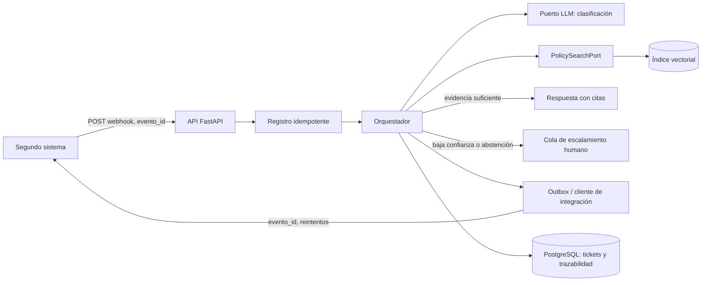

# Arquitectura — Etapa 4

## Alcance y demostración

La demostración implementa el camino síncrono mínimo para que sea ejecutable
localmente: recibe un evento, clasifica la solicitud, recupera evidencia de las
políticas, construye una respuesta trazable y la escala si la evidencia no es
concluyente. La persistencia de eventos es en memoria **solo para la demo**.
El diseño de producción usa PostgreSQL, una cola y el patrón *transactional
outbox*, como se describe abajo.

## Componentes y flujo

1. El segundo sistema entrega un evento con `evento_id` estable.
2. El registro de idempotencia rechaza una reutilización del mismo ID con otro
   contenido y reconoce como duplicado el mismo evento.
3. El orquestador clasifica, consulta RAG y redacta únicamente desde las
   fuentes recuperadas. Si no hay evidencia o el mejor score es menor de 0.55,
   deja el ticket en `Escalado`.
4. Se registra un evento de salida. En producción, ticket, traza y outbox se
   guardan en una transacción; un worker lo entrega y aplica backoff.

## Diseño de datos

El modelo relacional propuesto conserva el sistema de registro como fuente de
verdad y evita usar la base vectorial como almacenamiento transaccional:

| Tabla | Campos relevantes | Propósito |
|---|---|---|
| `tickets` | `id`, `estado`, `area`, `categoria`, `prioridad`, `created_at` | estado actual del caso |
| `ticket_processing_runs` | `id`, `ticket_id`, `correlation_id`, `rag_score`, `escalated`, `model`, `latency_ms`, `token_count` | auditoría de cada ejecución |
| `integration_events` | `event_id` único, `payload_hash`, `direction`, `status`, `attempts`, `next_attempt_at` | idempotencia y entrega |
| `outbox_events` | `id`, `aggregate_id`, `payload`, `status`, `attempts` | entrega confiable después de confirmar la transacción |
| `escalations` | `ticket_id`, `reason`, `queue`, `status` | seguimiento humano |

Índices: `tickets(estado, area, created_at DESC)`,
`ticket_processing_runs(ticket_id, created_at DESC)`, índice único en
`integration_events(event_id)` e índice parcial de outbox pendiente por
`next_attempt_at`. Se debe usar una llave de correlación por flujo para cruzar
logs, trazas y eventos.

El índice vectorial usa chunks de 900 caracteres con 150 de solapamiento,
`all-MiniLM-L6-v2` y distancia coseno. Es consistente con la implementación
actual y reduce costo/latencia local; los umbrales 0.35 (evidencia mínima) y
0.55 (respuesta autónoma) deben calibrarse con un conjunto etiquetado antes de
producción. Metadatos obligatorios: versión de política, documento, página,
sección y fecha de ingesta.

## Ambientes, secretos y operación

Los ambientes `development`, `staging` y `production` tienen colecciones
vectoriales, bases de datos y credenciales independientes. Las variables se
inyectan desde un gestor de secretos; `.env` solo se admite localmente y nunca
se registra. El token del segundo sistema rota sin redeploy y los webhooks se
protegerán con firma HMAC además de TLS en producción.

## Capacidad y costo

Supuesto inicial: 5.000 tickets/mes, 600 tokens de entrada y 200 de salida por
ticket, para 4 millones de tokens mensuales. El presupuesto se configura con
`MONTHLY_AI_BUDGET_USD`; el cálculo usa tarifas configurables por millón de
tokens y se publica en la telemetría. Al 80 % se genera alerta; al 100 % el
orquestador deja de invocar el LLM, conserva RAG extractivo y enruta a revisión
humana. Así no se sacrifica trazabilidad ni se excede el presupuesto.
